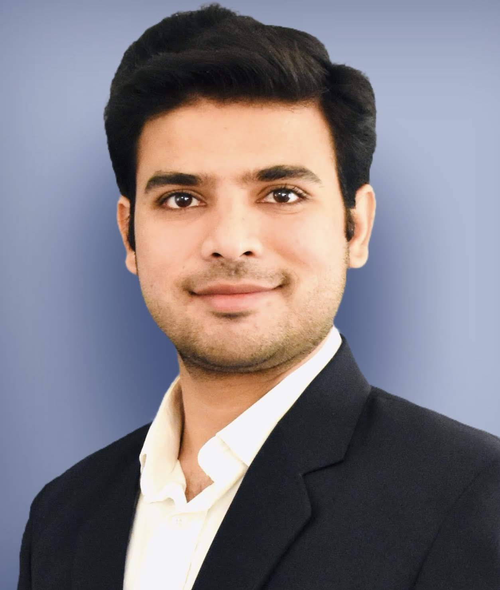

## About me

   
  
  
 I am a postdoctoral associate in neuroscience in [Clark Lab](https://clarklab.yale.edu/) at [Yale University](https://www.yale.edu/). I am interested in sensory neuroscience and currently working to understand how the visual information is processed inside the brain. I use fruit fly as a model organism to understand how neural circuitry works to interpret complex visual patterns in the natural world. I use psychophysical experiments and live 2-photon imaging to find answers to these problems. 

Prior to my current position, I completed my Ph.D. in physics at the University of Pittsburgh. During my doctoral studies, I explored the growth dynamics of bacteriumE. Coli and developed a specialized microfluidic device to study the inheritance patterns of physical cellular traits, such as cell size, across multiple generations of bacteria.

Outside of my academic pursuits, I enjoy playing cricket, reading about archaeological discoveries and attending live music concerts. 

  Thank you for visiting my website. Please feel free to explore my work and reach out via email if you'd like to connect or discuss further.

## Contact Information
Email: harsh.vashistha@yale.edu 
